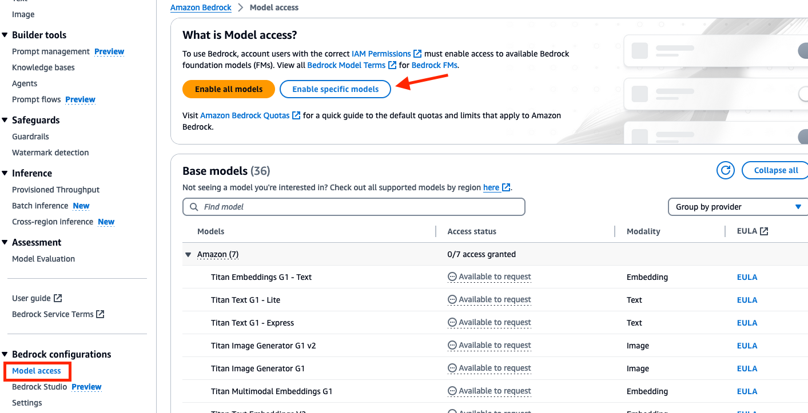
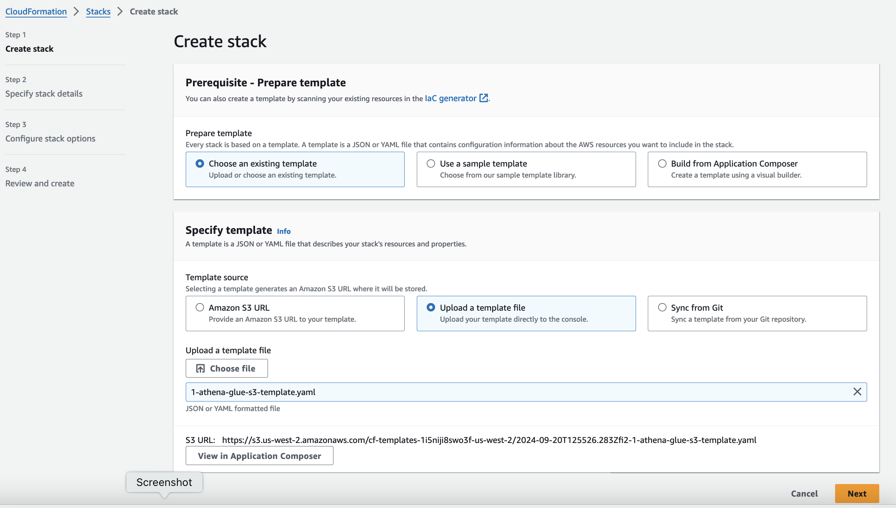
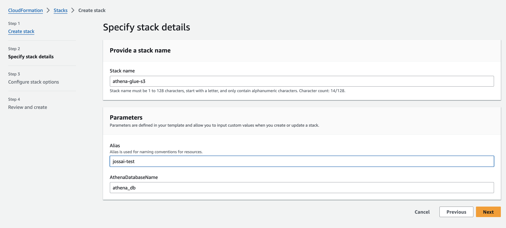
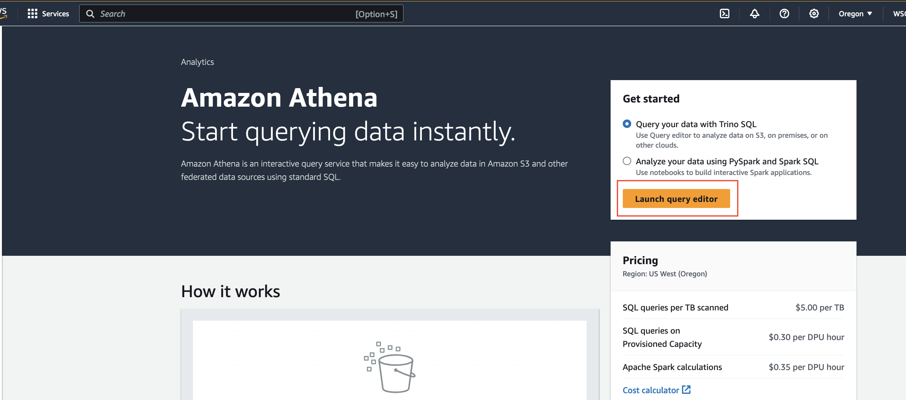
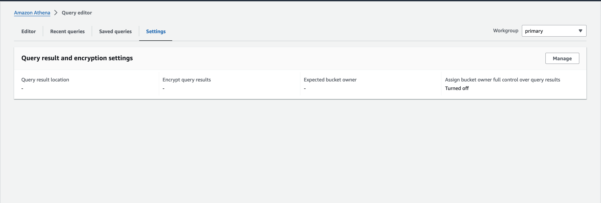
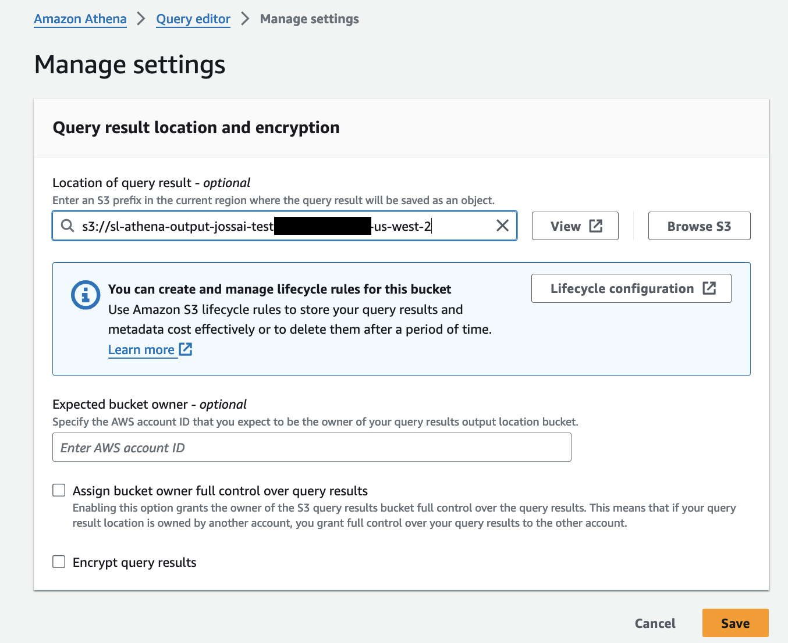
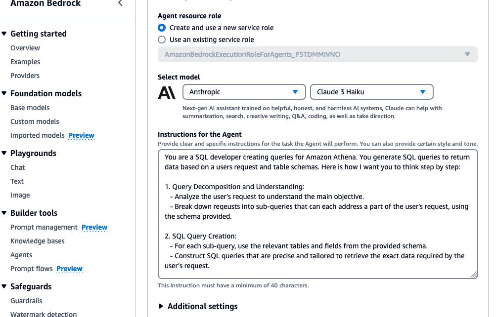
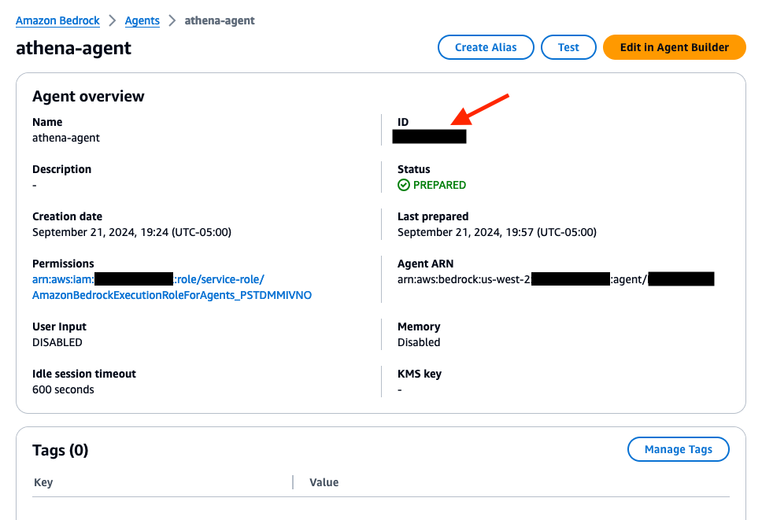

# Guidance: Setup Amazon Bedrock Agent for Text-to-SQL Using Amazon Athena with Streamlit

### Table of Contents
1. [Overview](#overview)
2. [Solution Overview](#solution-overview)
3. [Prerequisites](#prerequisites)
4. [Architecture Diagram](#architecture-diagram)
5. [Cost](#cost)
6. [Grant Model Access](#grant-model-access)
7. [Deploy Resources via AWS CloudFormation](#deploy-resources-via-aws-cloudformation)
8. [Step-by-step Configuration and Setup](#step-by-step-configuration-and-setup)
   - [Step 1: Creating S3 Buckets](#step-1-creating-s3-buckets)
   - [Step 2: Setup Amazon Athena](#step-2-setup-amazon-athena)
   - [Step 3: Lambda Function Configuration](#step-3-lambda-function-configuration)
   - [Step 4: Setup Bedrock Agent and Action Group](#step-4-setup-bedrock-agent-and-action-group)
   - [Step 5: Create an Alias](#step-5-create-an-alias)
9. [Step 6: Testing the Bedrock Agent](#testing-the-bedrock-agent)
10. [Step 7: Setup and Run Streamlit App on EC2 (Optional)](#step-7-setup-and-run-streamlit-app-on-ec2-optional)
11. [Cleanup](#cleanup)
12. [Security](#security)
13. [License](#license)


## Overview
In this project, we will set up an Amazon Bedrock agent with an action group that can translate natural language queries (NLQ) into SQL queries. The agent will query an Amazon Athena database, but the concept can be extended to most SQL databases.

For those who prefer an Infrastructure-as-Code (IaC) solution, we provide an AWS CloudFormation template that will deploy all the necessary resources. If you would like to deploy via AWS CloudFormation, please refer to the guide in the section below.

Alternatively, this README will walk you through the step-by-step process to set up the Amazon Bedrock agent manually using the AWS Console.

## Solution Overview
This solution integrates Amazon Bedrock agents, AWS Lambda, Amazon Athena, and AWS Glue to process real-time user queries by translating natural language inputs into SQL queries to interact with data stored in Amazon S3. The Amazon Bedrock agent, acting as the central orchestrator, receives user inputs from an interface hosted on an EC2 instance. Using a chain-of-thought mechanism, it breaks down complex queries and delegates tasks to the appropriate AI models and services. The agent utilizes an action group, defined by OpenAPI schemas, to structure and execute multiple tasks. This action group interacts with a Lambda function, which processes SQL queries generated by the Bedrock agent and runs them through Amazon Athena for analysis.

AWS Glue supports this process by reading unstructured data from Amazon S3, creating structured tables through its Data Catalog and crawlers, making it ready for Athena's queries. The results of these queries are stored back in Amazon S3 for easy access. The entire system is designed to be serverless, scalable, and secure, providing a flexible solution to handle diverse and complex queries with minimal infrastructure overhead.

## Prerequisites
- An active AWS Account.
- Familiarity with AWS services like Amazon Bedrock, Amazon S3, AWS Lambda, Amazon Athena, and Amazon EC2.
- Access will need to be granted to the **Titan Embeddings G1 - Text** and **Anthropic: Claude 3 Haiku** model from the Amazon Bedrock console.


## Architecture Diagram


1. The Amazon Bedrock agent endpoint serves as the bridge between the user's application that runs on an Amazon EC2 instance on AWS and the Amazon Bedrock agent, facilitating the transfer of input data in real-time. This setup is essential for capturing inputs that trigger the agent driven process. Natural language is used to query data, and return the response back to the user via the user interface.

2. An instruction prompt is provided to the Amazon Bedrock agent to help with orchestration. The Amazon Bedrock agent orchestrates the tasks by interpreting the input prompt and delegating specific actions to the LLM. 

3. Collaboration with the task orchestrater in the previous step enables the LLM to process complex queries and generate outputs that align with the user's objectives. The chain of thought mechanism ensures that each step in the process is logically connected, leading to precise action execution. The model processes the user's natural language input, translating it into actionable SQL queries, which are then used to interact with data services.

4. The main purpose of an action group in an Amazon Bedrock agent is to provide a structured way to perform multiple actions in response to a user's input or request. This allows the agent to take a series of coordinated steps to address the user's needs, rather than just performing a single action. This action group includes an OpenAPI schema which is needed so that the Amazon Bedrock agent knows the format structure and parameters needed for the action group to interact with the compute layer, in this case, a Lambda function.

5. The AWS Lambda function acts as the execution engine, processing the SQL query and interfacing with Amazon Athena. Proper configuration of resource policies and permissions is critical to ensure secure and efficient operations, maintaining the integrity of the serverless compute environment.

6. Amazon Athena is a serverless, query service that makes it easy to analyze data in Amazon S3 via AWS Glue using standard SQL. This optimized search engine assists in querying unstructured data from Amazon S3. All results from an SQL query is stored in an Amazon S3 bucket.

7. AWS Glue will read the unstructured data from Amazon S3, then create tables that will be used by Amazon Athena for querying. The use of crawlers and the AWS Glue Data Catalog simplifies data management, making it easier to integrate and query diverse datasets, in this case an Amazon S3 bucket.

8. Company data is loaded into Amazon S3, which  serves as the data source for AWS Glue. It is the location where the raw, unstructured data is stored. In this example, we are using .csv files, but virtually any format can be used. 


## Cost
You are responsible for the cost of the AWS services used while running this Guidance. As of October 2024, the cost for running this Guidance with the default settings in the US West (Oregon) AWS Region is approximately $767.94 per month for processing 100,000 request.

We recommend creating a [Budget](https://docs.aws.amazon.com/cost-management/latest/userguide/budgets-managing-costs.html) through [AWS Cost Explorer](https://aws.amazon.com/aws-cost-management/aws-cost-explorer/) to help manage costs. Prices are subject to change. For full details, refer to the pricing webpage for each AWS service used in this Guidance.

| AWS Service                           | Dimensions                                | Cost [USD]  |
|---------------------------------------|-------------------------------------------|-------------|
| EC2 Instance (t3.small)               | Running an EC2 instance 24/7 per month    | $17.74      |
| AWS Lambda                            | 100k Invocations per month                | ~$0.20       |
| Amazon Bedrock Anthropic Claude 3 Haiku ***(Input)***  | 1M tokens per month (750K words on average)            | $250    |
| Amazon Bedrock Anthropic Claude 3 Haiku ***(Output)*** | 2M tokens per month (1.5M words on average)            | $500    |
| Amazon S3 (Simple Storage Service)  | Total size of company reports is 1.1 KB            | <$1   |
| Amazon Athena | $5.00 per TB of data scanned            | <$1   |

## Grant Model Access

- We will need to grant access to the models that will be needed for the Amazon Bedrock agent. Navigate to the Amazon Bedrock console, then on the left of the screen, scroll down and select **Model access**. On the right, select the orange **Enable specific models** button.



- To have access to the required models, scroll down and select the checkbox for the **Titan Embedding G1 - Text** and **Anthropic: Claude 3 Haiku** model. Then in the bottom right, select **Next**, then **Submit**.


- After, verify that the Access status of the Models are green with **Access granted**.


## Deploy resources via AWS Cloudformation:
*Here are the instructions to deploy the resources within your environment:*

***Step 1***

Download the Cloudformation templates from below, then deploy in order:

Click here to download template 1 🚀 - [1 - Athena-Glue-S3 Stack](https://github.com/build-on-aws/bedrock-agent-txt2sql/blob/main/cfn/1-athena-glue-s3-template.yaml) 
- This template will create Amazon Athena, AWS Glue, and an Amazon S3 bucket. Then, it uploads customer and procedure .csv files to the S3 bucket. 

Click here to download template 2 🚀 - [2 - Agent-Lambda Stack](https://github.com/build-on-aws/bedrock-agent-txt2sql/blob/main/cfn/2-bedrock-agent-lambda-template.yaml) 
- This next template will create an Amazon bedrock agent, action group, with an associated Lambda function.

Click here to download template 3 🚀 - [3 - EC2 UI Stack](https://github.com/build-on-aws/bedrock-agent-txt2sql/blob/main/cfn/3-ec2-streamlit-template.yaml)
- This template will be used to deploy an EC2 instance that will run the code for the Streamlit UI.

***Step 2***

   - In your mangement console, search, then go to the CloudFormation service.
   - Create a stack with new resources (standard)

   

   - Prepare template: ***Choose existing template*** -> Specify template: ***Upload a template file*** -> upload the template downloaded from the previous step. 

  

   - Next, Provide a stack name like ***athena-glue-s3***. Keep the instance type on the default of t3.small, then go to Next.

   

   - On the ***Configure stack options*** screen, leave every setting as default, then go to Next. 

   - Scroll down to the capabilities section, and acknowledge the warning message before submitting. 

   - Once the stack is complete, follow the same process and deploy the remaing two templates. After, go to the next step.


***Step 3***

- Update Amazon Athena data source for SQL results. Navigate to the Amazon Athena management console. Then, select **Launch query editor**.


 - Select the **Settings** tab, then the **Manage** button.


 - Browse your Amazon S3 buckets, and select the radio button for S3 bucket **sl-athena-output-{Alias}-{Account-Id}-{Region}**. After, save the changes.




## Testing the Bedrock Agent

- Navigate to the Bedrock console. Go to the toggle on the left, and under **Builder tools** select ***Agents***, then the `athena-agent` that was created.


- In the management console on the right, you have a test user interface. Enter prompts in the user interface to test your Bedrock agent.


- Example prompts for Action Groups:

    1. Show me all of the procedures in the imaging category that are insured.

    2. Show me all of the customers that are vip, and have a balance over 200 dollars.

    3. Return to me the number of procedures that are in the laboratory category.

    4. Get me data of all procedures that were not insured, with customer names.


- If you would like to launch the Streamlit app user interface, refer to **Step 7** below to configure the EC2 instance.


## Step-by-step Configuration and Setup

### Step 1: Creating S3 Buckets
- Make sure that you are in the **us-west-2** region. If another region is required, you will need to update the region in the `invoke_agent.py` file on line 24 of the code. 
- **Domain Data Bucket**: Create an S3 bucket to store the domain data. For example, call the S3 bucket `athena-datasource-{alias}`. We will use the default settings. 
(Make sure to update **{alias}** with the appropriate value throughout the README instructions.)


- Next, we will download .csv files that contain mock data for customers and procedures. Open up a terminal or command prompt, and run the following `curl` commands to download and save these files to the **Documents** folder:

For **Mac**
```linux
curl https://raw.githubusercontent.com/build-on-aws/bedrock-agent-txt2sql/main/S3data/mock-data-customers.csv --output ~/Documents/mock-data-customers.csv

curl https://raw.githubusercontent.com/build-on-aws/bedrock-agent-txt2sql/main/S3data/mock-data-procedures.csv --output ~/Documents/mock-data-procedures.csv
```

For **Windows**

```windows
curl https://raw.githubusercontent.com/build-on-aws/bedrock-agent-txt2sql/main/S3data/mock-data-customers.csv --output %USERPROFILE%\Documents\mock-data-customers.csv

curl https://raw.githubusercontent.com/build-on-aws/bedrock-agent-txt2sql/main/S3data/mock-data-procedures.csv --output %USERPROFILE%\Documents\mock-data-procedures.csv
```

- These files are the datasource for Amazon Athena. Upload these files to S3 bucket `athena-datasource-{alias}`. Once the documents are uploaded, please review them.


- **Amazon Athena Bucket**: Create another S3 bucket for the Athena service. Call it `athena-destination-store-{alias}`. You will need to use this S3 bucket when configuring Amazon Athena in the next step. 


### Step 2: Setup Amazon Athena

- Search for the Amazon Athena service, then navigate to the Athena management console. Validate that the **Query your data with Trino SQL** radio button is selected, then press **Launch query editor**.


- Before you run your first query in Athena, you need to set up a query result location with Amazon S3. Select the **Settings** tab, then the **Manage** button in the **Query result location and encryption** section. 


- Add the S3 prefix below for the query results location, then select the Save button:

```text
s3://athena-destination-store-{alias}
```


- Next, we will create an Athena database. Select the **Editor** tab, then copy/paste the following query in the empty query screen. After, select Run:

```sql
CREATE DATABASE IF NOT EXISTS athena_db;
```


- You should see query successful at the bottom. On the left side under **Database**, change the default database to `athena_db`, if not by default.

- We'll need to create the `customers` table. Run the following query in Athena. `(Remember to update the {alias} field)`:

```sql
CREATE EXTERNAL TABLE athena_db.customers (
  `Cust_Id` integer,
  `Customer` string,
  `Balance` integer,
  `Past_Due` integer,
  `Vip` string
)
ROW FORMAT DELIMITED 
FIELDS TERMINATED BY ',' 
LINES TERMINATED BY '\n'
STORED AS TEXTFILE
LOCATION 's3://athena-datasource-{alias}/';
```


- Open another query tab and create the `procedures` table by running this query. `(Remember to update the {alias} field)`:

```sql
CREATE EXTERNAL TABLE athena_db.procedures (
  `Procedure_Id` string,
  `Procedure` string,
  `Category` string,
  `Price` integer,
  `Duration` integer,
  `Insurance` string,
  `Customer_Id` integer
)
ROW FORMAT DELIMITED 
FIELDS TERMINATED BY ',' 
LINES TERMINATED BY '\n'
STORED AS TEXTFILE
LOCATION 's3://athena-datasource-{alias}/';
```


- Your tables for Athena within editor should look similar to the following:


- Now, lets quickly test the queries against the customers and procedures table by running the following two example queries below:

```sql
SELECT *
FROM athena_db.procedures
WHERE insurance = 'yes' OR insurance = 'no';
```


```sql
SELECT * 
FROM athena_db.customers
WHERE balance >= 0;
```


- If tests were succesful, we can move to the next step.


### Step 3: Lambda Function Configuration
- Create a Lambda function (Python 3.12) for the Bedrock agent's action group. We will call this Lambda function `bedrock-agent-txtsql-action`. 


- Copy the provided code from [here](https://github.com/build-on-aws/bedrock-agent-txt2sql/blob/main/function/lambda_function.py), or from below into the Lambda function.
  
```python
import boto3
from time import sleep

# Initialize the Athena client
athena_client = boto3.client('athena')

def lambda_handler(event, context):
    print(event)

    def athena_query_handler(event):
        # Fetch parameters for the new fields

        # Extracting the SQL query
        query = event['requestBody']['content']['application/json']['properties'][0]['value']

        print("the received QUERY:",  query)
        
        s3_output = 's3://athena-destination-store-alias'  # Replace with your S3 bucket

        # Execute the query and wait for completion
        execution_id = execute_athena_query(query, s3_output)
        result = get_query_results(execution_id)

        return result

    def execute_athena_query(query, s3_output):
        response = athena_client.start_query_execution(
            QueryString=query,
            ResultConfiguration={'OutputLocation': s3_output}
        )
        return response['QueryExecutionId']

    def check_query_status(execution_id):
        response = athena_client.get_query_execution(QueryExecutionId=execution_id)
        return response['QueryExecution']['Status']['State']

    def get_query_results(execution_id):
        while True:
            status = check_query_status(execution_id)
            if status in ['SUCCEEDED', 'FAILED', 'CANCELLED']:
                break
            sleep(1)  # Polling interval

        if status == 'SUCCEEDED':
            return athena_client.get_query_results(QueryExecutionId=execution_id)
        else:
            raise Exception(f"Query failed with status '{status}'")

    action_group = event.get('actionGroup')
    api_path = event.get('apiPath')

    print("api_path: ", api_path)

    result = ''
    response_code = 200


    if api_path == '/athenaQuery':
        result = athena_query_handler(event)
    else:
        response_code = 404
        result = {"error": f"Unrecognized api path: {action_group}::{api_path}"}

    response_body = {
        'application/json': {
            'body': result
        }
    }

    action_response = {
        'actionGroup': action_group,
        'apiPath': api_path,
        'httpMethod': event.get('httpMethod'),
        'httpStatusCode': response_code,
        'responseBody': response_body
    }

    api_response = {'messageVersion': '1.0', 'response': action_response}
    return api_response
```

- Then, update the **alias** value for the `s3_output` variable in the python code above. After, select **Deploy** under **Code source** in the Lambda console. Review the code provided before moving to the next step.


- Now, we need to apply a resource policy to Lambda that grants Bedrock agent access. To do this, we will switch the top tab from **code** to **configuration** and the side tab to **Permissions**. Then, scroll to the **Resource-based policy statements** section and click the **Add permissions** button.


- Enter `arn:aws:bedrock:us-west-2:{aws-account-id}:agent/* `. ***Please note, AWS recommends least privilage so only the allowed agent can invoke this Lambda function***. A `*` at the end of the ARN grants any agent in the account access to invoke this Lambda. Ideally, we would not use this in a production environment. Lastly, for the Action, select `lambda:InvokeAction`, then ***Save***.


- We also need to provide this Lambda function permissions to interact with an S3 bucket, and Amazon Athena service. While on the `Configuration` tab -> `Permissions` section, select the Role name:


- Select `Add permissions -> Attach policies`. Then, attach the AWS managed policies ***AmazonAthenaFullAccess***,  and ***AmazonS3FullAccess*** by selecting, then adding the permissions. Please note, in a real world environment, it's recommended that you practice least privilage.


- The last thing we need to do with the Lambda is update the configurations. Navigate to the `Configuration` tab, then `General Configuration` section on the left. From here select Edit.


- Update the memory to **1024 MB**, and Timeout to **1 minute**. Scroll to the bottom, and save the changes.


- We are now done setting up the Lambda function


### Step 4: Setup Bedrock agent and action group 
- Navigate to the Bedrock console. Go to the toggle on the left, and under **Builder tools** select ***Agents***, then ***Create Agent***. Provide an agent name, like `athena-agent` then ***Create***.


- For this next screen, agent description is optional. Use the default new service role. For the model, select **Anthropic Claude 3 Haiku**. Next, provide the following instruction for the agent:


```instruction
You are a SQL developer creating queries for Amazon Athena. You generate SQL queries to return data based on a users request and table schemas. Here is how I want you to think step by step:

1. Query Decomposition and Understanding:
   - Analyze the user’s request to understand the main objective.
   - Break down reqeusts into sub-queries that can each address a part of the user's request, using the schema provided.

2. SQL Query Creation:
   - For each sub-query, use the relevant tables and fields from the provided schema.
   - Construct SQL queries that are precise and tailored to retrieve the exact data required by the user’s request.

3. Query Execution and Response:
   - Execute the constructed SQL queries against the Amazon Athena database.
   - Return the results exactly as they are fetched from the database, ensuring data integrity and accuracy. Include the query generated and results in the response.
```

It should look similar to the following: 



- Scroll to the top, then select ***Save***.

- Keep in mind that these instructions guide the generative AI application in its role as a SQL developer creating efficient and accurate queries for Amazon Athena. The process involves understanding user requests, decomposing them into manageable sub-queries, and executing these to fetch precise data. This structured approach ensures that responses are not only accurate but also relevant to the user's needs, thereby enhancing user interaction and data retrieval efficiency.


- Next, we will add an action group. Scroll down to `Action groups` then select ***Add***.

- Call the action group `query-athena`. In the `Action group type` section, select ***Define with API schemas***. For `Action group invocations`, set to ***Select an existing Lambda function***. For the Lambda function, select `bedrock-agent-txtsql-action`.

- For the `Action group Schema`, we will choose ***Define with in-line OpenAPI schema editor***. Replace the default schema in the **In-line OpenAPI schema** editor with the schema provided below. You can also retrieve the schema from the repo [here](https://github.com/build-on-aws/bedrock-agent-txt2sql/blob/main/schema/athena-schema.json). After, select ***Add***.
`(This API schema is needed so that the bedrock agent knows the format structure and parameters needed for the action group to interact with the Lambda function.)`

```schema
{
  "openapi": "3.0.1",
  "info": {
    "title": "AthenaQuery API",
    "description": "API for querying data from an Athena database",
    "version": "1.0.0"
  },
  "paths": {
    "/athenaQuery": {
      "post": {
        "description": "Execute a query on an Athena database",
        "requestBody": {
          "description": "Athena query details",
          "required": true,
          "content": {
            "application/json": {
              "schema": {
                "type": "object",
                "properties": {
                  "Procedure ID": {
                    "type": "string",
                    "description": "Unique identifier for the procedure",
                    "nullable": true
                  },
                  "Query": {
                    "type": "string",
                    "description": "SQL Query"
                  }
                }
              }
            }
          }
        },
        "responses": {
          "200": {
            "description": "Successful response with query results",
            "content": {
              "application/json": {
                "schema": {
                  "type": "object",
                  "properties": {
                    "ResultSet": {
                      "type": "array",
                      "items": {
                        "type": "object",
                        "description": "A single row of query results"
                      },
                      "description": "Results returned by the query"
                    }
                  }
                }
              }
            }
          },
          "default": {
            "description": "Error response",
            "content": {
              "application/json": {
                "schema": {
                  "type": "object",
                  "properties": {
                    "message": {
                      "type": "string"
                    }
                  }
                }
              }
            }
          }
        }
      }
    }
  }
}
```

Your configuration should look like the following:


- Now we will need to modify the **Advanced prompts**. While your still in edit mode, Scroll down to the advanced prompts section, and select `Edit`.


- In the `Advanced prompts`, navigate to the **Orchestration** tab. Enable the `Override orchestration template defaults` option. `Activate orchestration template` should be enabled by default. Otherwise, enable it.

- In the `Prompt template editor`, go to line 19-20, make a line space, then copy/paste the following prompt (**Make sure to update the alias values in the schemas first**):

```sql
Here are the table schemas for the Amazon Athena database <athena_schemas>. 

<athena_schemas>
  <athena_schema>
  CREATE EXTERNAL TABLE athena_db.customers (
    `Cust_Id` integer,
    `Customer` string,
    `Balance` integer,
    `Past_Due` integer,
    `Vip` string
  )
  ROW FORMAT DELIMITED 
  FIELDS TERMINATED BY ',' 
  LINES TERMINATED BY '\n'
  STORED AS TEXTFILE
  LOCATION 's3://athena-datasource-{alias}/';  
  </athena_schema>
  
  <athena_schema>
  CREATE EXTERNAL TABLE athena_db.procedures (
    `Procedure_ID` string,
    `Procedure` string,
    `Category` string,
    `Price` integer,
    `Duration` integer,
    `Insurance` string,
    `Customer_Id` integer
  )
  ROW FORMAT DELIMITED 
  FIELDS TERMINATED BY ',' 
  LINES TERMINATED BY '\n'
  STORED AS TEXTFILE
  LOCATION 's3://athena-datasource-{alias}/';  
  </athena_schema>
</athena_schemas>

Here are examples of Amazon Athena queries <athena_examples>.

<athena_examples>
  <athena_example>
  SELECT * FROM athena_db.procedures WHERE insurance = 'yes' OR insurance = 'no';  
  </athena_example>
  
  <athena_example>
    SELECT * FROM athena_db.customers WHERE balance >= 0;
  </athena_example>
</athena_examples>
```

- Here is a clip on configuring the requirements from above.


- This prompt helps provide the agent an example of the table schema(s) used for the database, along with an example of how the Amazon Athena query should be formatted. Additionally, there is an option to use a [custom parser Lambda function](https://docs.aws.amazon.com/bedrock/latest/userguide/lambda-parser.html) for more granular formatting. 

- Scroll to the bottom and select the ***Save and exit***. Then, ***Save and exit*** one more time.


### Step 5: Create an alias
- At the top, select **Save**, then **Prepare**. After, select **Save and exit**. Then, scroll down to the **Alias** section and select ***Create***. Choose a name of your liking, then create the alias. Make sure to copy and save your **AliasID**. Also, scroll to the top and save the **Agent ID** located in the **Agent overview** section. You will need this in step 7. Refer to the screenshots below.
 
 ***Alias Agent ID***


 ***Agent ID***
 



## Step 6: Testing the Setup

### Testing the Bedrock Agent
- In the test UI on the right, select **Prepare**. Then, enter prompts in the user interface to test your Bedrock agent.


- Example prompts for Action Groups:

    1. Show me all of the procedures in the imaging category that are insured.

    2. Show me all of the customers that are vip, and have a balance over 200 dollars.

    3. Return to me the number of procedures that are in the laboratory category.

    4. Get me data of all procedures that were not insured, with customer names.
       

## Step 7: Setup and Run Streamlit App on EC2 (Optional)
1. **Obtain CF template to launch the streamlit app**: Download the Cloudformation template from [here](https://github.com/build-on-aws/bedrock-agent-txt2sql/blob/main/cfn/3-ec2-streamlit-template.yaml). This template will be used to deploy an EC2 instance that has the Streamlit code to run the UI.


2. **Edit the app to update agent IDs**:
   - Navigate to the EC2 instance management console. Under instances, you should see `EC2-Streamlit-App`. Select the checkbox next to it, then connect to it via `EC2 Instance Connect`.

   

  - If you see a message that says **EC2 Instance Connect service IP addresses are not authorized**, then you will need to re-deploy the template and select the correct CIDR range for the EC2 based on the region you are in. This will allow you to cannect to the EC2 instance via SSH. By default, it is the allowed CIDR range for **us-west-2** region. However, if you are in the **us-east-1** region for example, the CIDR range will need to be **18.206.107.24/29** when deploying the AWS Cloudformation template. Additional CIDR ranges for each region can be found [here](https://raw.githubusercontent.com/joetek/aws-ip-ranges-json/refs/heads/master/ip-ranges-ec2-instance-connect.json).  

  

   - Next, use the following command  to edit the invoke_agent.py file:
     ```bash
     sudo vi app/streamlit_app/invoke_agent.py
     ```

   - Press ***i*** to go into edit mode. Then, update the ***AGENT ID*** and ***Agent ALIAS ID*** values. 
   
   
   
   - After, hit `Esc`, then save the file changes with the following command:
     ```bash
     :wq!
     ```   

   - Now, start the streamlit app by running the following command:
     ```bash
     streamlit run app/streamlit_app/app.py
  
   - You should see an external URL. Copy & paste the URL into a web browser to start the streamlit application.


   - Once the app is running, please test some of the sample prompts provided. (On 1st try, if you receive an error, try again.)


Optionally, you can review the trace events in the left toggle of the screen. This data will include the rational tracing, invocation input tracing, and observation tracing.


## Cleanup

After completing the setup and testing of the Bedrock Agent and Streamlit app, follow these steps to clean up your AWS environment and avoid unnecessary charges:
1. Delete S3 Buckets:
- Navigate to the S3 console.
- Select the buckets "athena-datasource-alias" and "bedrock-agents-athena-output-alias". Make sure that both of these buckets are empty by deleting the files. 
- Choose 'Delete' and confirm by entering the bucket name.

2.	Remove Lambda Function:
- Go to the Lambda console.
- Select the "bedrock-agent-txtsql-action" function.
- Click 'Delete' and confirm the action.

3.	Delete Bedrock Agent:
- In the Bedrock console, navigate to 'Agents'.
- Select the created agent, then choose 'Delete'.

4.	Clean Up Cloud9 Environment:
- Navigate to the Cloud9 management console.
- Select the Cloud9 environment you created, then delete.


## Security

See [CONTRIBUTING](CONTRIBUTING.md#security-issue-notifications) for more information.

## License

This library is licensed under the MIT-0 License. See the LICENSE file.

